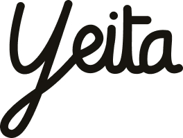
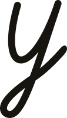
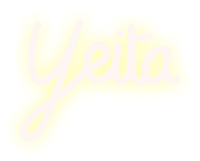
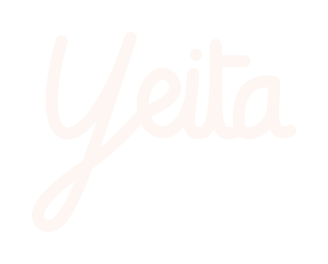

# 💚 Logo & Déclinaisons

## Choisi le format qui te correspond

JPG : Si tu as besoin du logo sur fond blanc, c'est ici !

Le format JPG est un format d'image pixel non-transparent.&#x20;

:information\_source: Il est à préférer pour les usages sur fond blanc obligatoirement, comme par exemple les emails. <mark style="color:blue;">Si tu as le choix, préféres le format PNG.</mark>

PNG : Si tu as besoin du logo sur fond transparent, c'est ici !

Le format PNG est un format d'image pixel transparent.

:information\_source: Il est à préférer pour tous vos montages, pour tout usage sur fond uni, et pour la communication en général.

SVG : Si tu as besoin du logo en format vectoriel / web, c'est ici !

Le format SVG est un format d'image vectorielle composé de lignes de code. C'est un format qui ne se pixelise jamais !

:information\_source: Il est à préférer pour le web, les landing pages & Figma.

