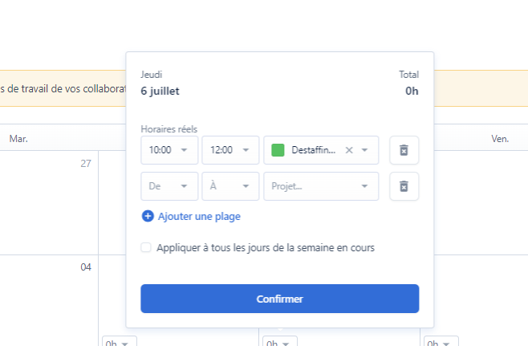

# Payfit, CRA & Note de Frais

**Il s'agit de l'outil qui te permet de :**&#x20;

* [ ] Faire tes demandes d'absences et de congés :beach:
* [ ] Récupérer ton Bulletin de Salaire _(disponible le 1er de chaque mois )_🎉💰
* [ ] [Déclarer tes notes de frais ](payfit-cra-and-note-de-frais.md#note-de-frais-depense-deplacement)
* [ ] [Saisir ton CRA : Suivi du Temps de Travail en Projet ](payfit-cra-and-note-de-frais.md#suivi-du-temps-de-travail)😎🚀

## **Comment utiliser PayFit - Guide Pratique 😍**



## Suivi du temps de travail **(CRA)**

Il permet de suivre ton activité chez ton client et au sein de Yeita.&#x20;

**Quelques fondamentaux pour le remplir correctement  😎 :**&#x20;

**Tout d'abord, tu peux saisir 3 types d'activités :** \
&#x20;**Jours travaillés en mission / Activité Yeita / Activité Cagnotte Creative**

* **Saisir les jours d'activités chez ton client** VS **les jours chez Yeita ou en les jours cagnotte Creative**\
  Quand c'est un jour travaillé chez le client, spécifie le bien dans ton CRA, tu as un onglet avec le nom de ta mission. \
  Ensuite en fonction de la nature de ton activité/destaffing : tu mets "Yeita" quand tu participes à un Yeita Day ou tu es en intercontrat ou pour tout autre évènement Yeita. Si par ex tu prends une journée pour rédiger du contenu, faire une conf', une formation ou tout autre activité qui sollicite l'utilisation de la Cagnotte Creative. Tu mets l'onglet "Destaffing Cagnotte".

\

* Pour le destaffing lié à la cagnotte Creative &#x20;

* Les jours de congés sont automatiquement remplis quand la demande est saisie au préalable&#x20;


Ne te tracasse pas pour les horaires journaliers, tu peux mettre 7h ou 8h sur les jours concernés _(même si tu fais plus ou moins😋)_&#x20;


🛑 **Important** 🛑  **:**&#x20;

* Il doit être rempli <mark style="color:red;">**avant le 25 de chaque mois**</mark>


Bien le remplir est très **très** <mark style="color:red;">**très**</mark> important car on se base sur cette déclaration d'activité pour facturer ton client.&#x20;


## Note de Frais / Dépenses / Déplacement🤑

Chacun est autonome sur ses réservations de train, hôtel…&#x20;

### Le budget des dépenses => “Du Bon Sens”😁&#x20;

* &#x20;🚄 Pour le train prévoir au plus tôt pour optimiser le prix . Ex Paris/Lille de 70€ à 110€&#x20;
* &#x20;🏢 Pour l'hôtel, si vous deviez rester sur place ou faire un déplacement sur 2 jours, on vise un budget entre 80 et 100€.

### Apéro/Repas/PetitDej’ chez le client 🥐🥨🧁🍾🍝

Aucun problème pour en faire, dans la mesure où cela permet de fidéliser ou faire rayonner Yeita encore plus


**Pour chaque dépense =  Note de frais à saisir dans PAYFIT avec le Justif (avec TVA)**


Les notes de frais seront remboursés directement sur le bulletin de salaire du mois en cours
